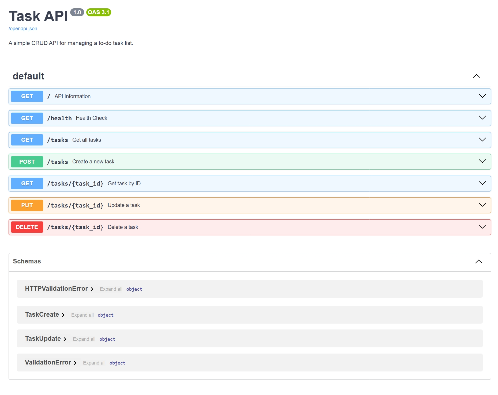

# 🚀 Task API - FlyRank Backend Internship (Week 2 Assignment)

A RESTful **Task Management API** built using **FastAPI** as part of the FlyRank Backend Development Internship - Week 2 Assignment.

This project implements complete **CRUD operations** (Create, Read, Update, Delete) for managing tasks and demonstrates fundamental backend concepts including HTTP methods, status codes, request validation, API documentation, and Git workflow.

---

## 📌 Project Overview

The Task API provides endpoints to manage a simple to-do list.

Users can:

- Create new tasks
- View all tasks
- View a specific task by ID
- Update existing tasks
- Delete tasks

The application uses **in-memory storage**, meaning data is stored temporarily while the server is running. Once the server restarts, the data resets.

---

# 🛠️ Technology Stack

| Technology | Purpose |
|------------|---------|
| Python | Programming Language |
| FastAPI | Backend Framework |
| Uvicorn | ASGI Server |
| Pydantic | Data Validation |
| Swagger UI | API Documentation |
| Git & GitHub | Version Control |

---

# 📂 Project Structure

```
Week-02/
│
├── main.py              # FastAPI application
├── requirements.txt     # Project dependencies
├── README.md            # Documentation
├── docs/
│   └── swagger-ui.png   # Swagger screenshot
└── .gitignore
```

---

# ⚙️ Installation & Setup

Follow these steps to run the project locally.

## 1. Clone Repository

```bash
git clone https://github.com/Muqadas1234/FlyRank-Internship.git
```

Move into the project directory:

```bash
cd FlyRank-Internship/Week-02
```

---

## 2. Create Virtual Environment

Create environment:

```bash
python -m venv venv
```

Activate environment:

### Windows

```bash
venv\Scripts\activate
```

### Linux / macOS

```bash
source venv/bin/activate
```

---

## 3. Install Dependencies

```bash
pip install -r requirements.txt
```

---

## 4. Run Application

Start FastAPI server:

```bash
uvicorn main:app --reload
```

The server will start at:

```
http://127.0.0.1:8000
```

---

# 📖 API Documentation

Interactive API documentation is available through Swagger UI:

```
http://127.0.0.1:8000/docs
```

Swagger UI allows testing all endpoints directly from the browser.

---

# 🔗 API Endpoints

| Method | Endpoint | Description | Response |
|--------|----------|-------------|----------|
| GET | `/` | Returns API information | 200 |
| GET | `/health` | Checks API health | 200 |
| GET | `/tasks` | Retrieves all tasks | 200 |
| GET | `/tasks/{task_id}` | Retrieves task by ID | 200 / 404 |
| POST | `/tasks` | Creates a new task | 201 / 400 |
| PUT | `/tasks/{task_id}` | Updates existing task | 200 / 404 |
| DELETE | `/tasks/{task_id}` | Deletes a task | 204 / 404 |

---

# 🧪 API Testing Examples

## 1. Create Task

### Request

```bash
curl -i -X POST http://127.0.0.1:8000/tasks \
-H "Content-Type: application/json" \
-d "{\"title\":\"Complete FlyRank Assignment\"}"
```

### Response

```
HTTP/1.1 201 Created
```

```json
{
    "id": 4,
    "title": "Complete FlyRank Assignment",
    "done": false
}
```

---

## 2. Get All Tasks

### Request

```bash
curl -i http://127.0.0.1:8000/tasks
```

### Response

```
HTTP/1.1 200 OK
```

---

## 3. Get Task By ID

### Request

```bash
curl -i http://127.0.0.1:8000/tasks/1
```

### Response

```
HTTP/1.1 200 OK
```

Example:

```json
{
    "id":1,
    "title":"Complete Python Homework",
    "done":false
}
```

---

## 4. Update Task

### Request

```bash
curl -i -X PUT http://127.0.0.1:8000/tasks/1 \
-H "Content-Type: application/json" \
-d "{\"title\":\"Updated Task\",\"done\":true}"
```

### Response

```
HTTP/1.1 200 OK
```

---

## 5. Delete Task

### Request

```bash
curl -i -X DELETE http://127.0.0.1:8000/tasks/1
```

### Response

```
HTTP/1.1 204 No Content
```

---

# 📸 Swagger UI

The API documentation can be viewed through Swagger UI.


---

# ✅ Assignment Requirements Completed

- ✅ FastAPI server setup
- ✅ Root and health endpoints
- ✅ GET all tasks
- ✅ GET task by ID
- ✅ POST task creation
- ✅ Input validation
- ✅ PUT task update
- ✅ DELETE task removal
- ✅ Correct HTTP status codes
- ✅ Swagger UI documentation
- ✅ GitHub repository
- ✅ README documentation

---

# ⭐ Additional Features

Implemented additional Swagger improvements:

- Custom API title
- API description
- Endpoint summaries
- Endpoint documentation

---

# 🧠 Key Learning Outcomes

Through this assignment, I learned:

- How client-server communication works
- Designing RESTful APIs
- CRUD implementation
- HTTP methods and status codes
- Request validation using Pydantic
- API testing with Swagger UI
- Git-based development workflow

---

# 👨‍💻 Author

**Muqadas**

Computer Science Graduate  
AI Engineer | Full Stack Developer

GitHub:
https://github.com/Muqadas1234


## 📸 Swagger UI Screenshot

